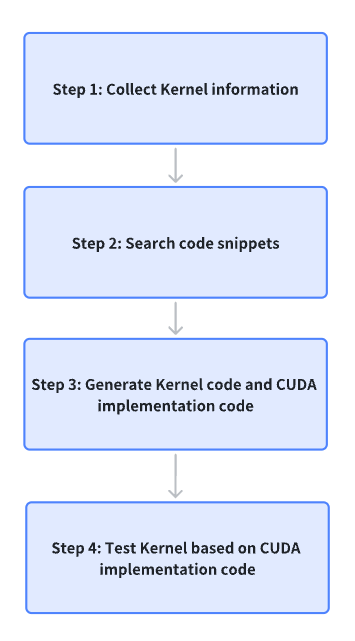

# Workflow

The following diagram briefly demonstrates how KernelGen helps you
to generate Kernel.

The generation process is as follows:

1. **Collect Kernel information**: User enters semantic operator definitions into KernelGen, for example, by referring to the [ReLU](https://docs.pytorch.org/docs/stable/generated/torch.nn.ReLU.html#ReLU) operator definitions. KernelGen collects operator basic parameters from the definitions.
2. **Search code snippets**: KernelGen searches code snippets similar to user's definitions as reference and extracts Kernel parameters. During this step, user can select to use the searched code snippets or not.
3. **Generate Kernel code and CUDA implementation code**: KernelGen generates codes of Kernel and CUDA implementation. CUDA implementation is used as a PyTorch benchmark reference.
4. **Test Kernel based on CUDA implementation code**：KernelGen tests Kernel based on the PyTorch benchmark and outputs the test results of Correctness and Speedup Ratio.
