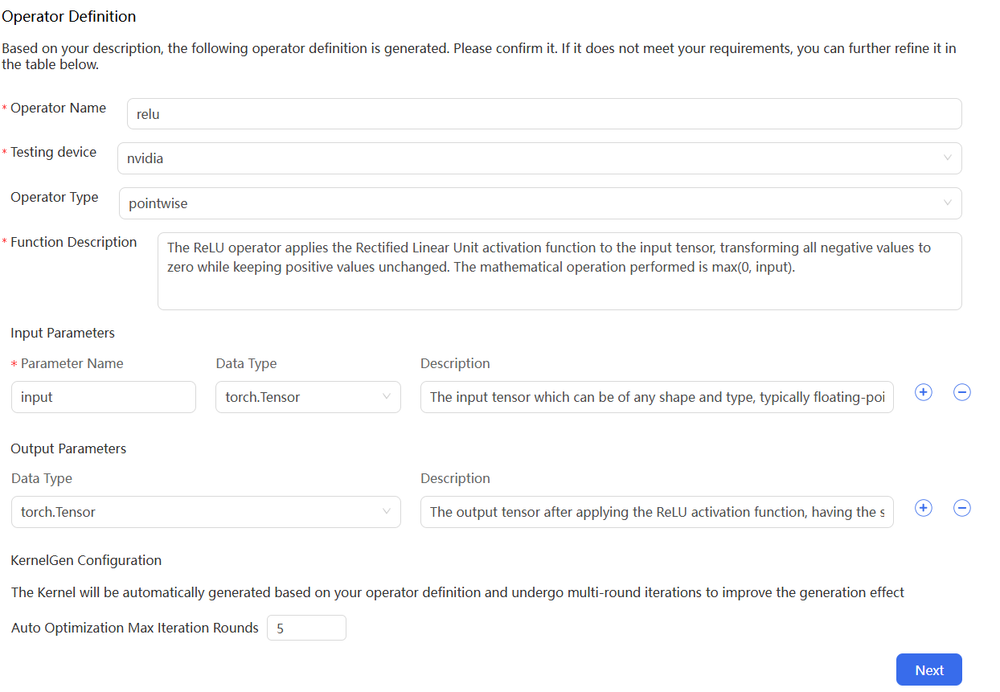

# Generate Kernels through your operator definitions

After signing in to KernelGen, you will see the welcome page.

On the welcome page, perform the following steps to generate Kernels:

1. In the text box, enter the prompts for operator definition generation, and then click {w=20px}.

   The prompts for operator definition generation must include information about the following:

   - operator name
   - function description
   - input parameters and data type
   - output parameters and data type

    KernelGen searches for a list of GitHub repositories to find code snippets similar to the operator definitions. For more information about the list of GitHub repositories, see [Repository list](../search-repo-list.md).

2. Click each URL to view the corresponding code snippet in the right panel.

   
   You can also view the source of code snippets from GitHub or view the original requirements:

   - To view the source of code snippets, click **View source on GitHub** in this panel.
   - To view the original requirements, close this panel and click **Expand to view the original requirements** on the top.

3. Select one or more URLs of repositories for reference or select the direct generation checkbox, and then click **Next**.
   
4. In the confirmation dialogue box, click **Confirm**.

5. On the operator definition and configuration page, modify the following parameters and configuration if needed, and then click **Next**：

   - In the **Operator Definition** section, modify the following parameters:
     - **Operator Name**: Extracted from your operator definitions.
     - **Testing device**: The operator testing device. This is different from the operator generation device you included in your prompts.
     - **Operator Type**: Inferred from your operator definitions.
     - **Function Description**: Extracted from your operator definitions.
     - **Input Parameters**: Extracted from your operator definitions.
     - **Output Parameters**: Extracted from your operator definitions.

   - In the **KernelGen Configuration** section, modify the following configuration:
     - **Auto Optimization Max Iteration Rounds**: The maximum number of iterations KernelGen attempts to pass the correctness test.
   

6. In the confirmation dialogue box, click **Confirm**.

   KernelGen begins to perform Kernel code generation, CUDA implementation, Correctness Test, and Speedup Ratio Test.

7. In the **KernelGen** panel on the right, check the statuses of the **Kernel**, **CUDA Implementation**, **Correctness Test**, and **Speedup Ratio Test**.

   The statuses turn to **Generating**.

   
