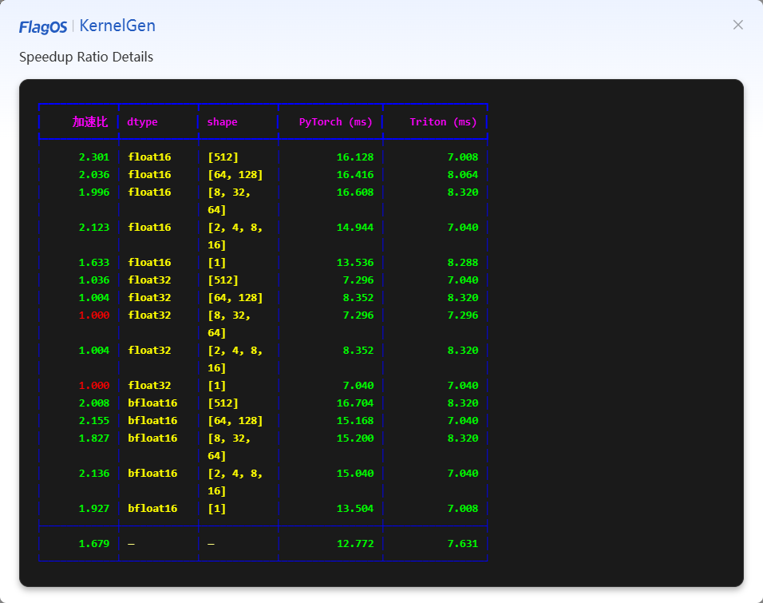

# View generation results and select optimal Kernel

When the statuses of the **Kernel**, **CUDA Implementation**, **Correctness Test**, and **Speedup Ratio Test** change to **Completed**, the Kernel is generated successfully. Then, you can evaluate the testing results and select an optimal Kernel.

Perform the following steps to view the testing results and select an optimal Kernel:

- If **Correctness Test** turns to green, the correctness is passed. Then, check whether the overall **Speedup Test** meets your criteria.

   

  - If the overall **Speedup Test** meets your criteria, perform the following steps:
    1. Click the **View Details** to view the speedup of each scenario.
    
    2. If speedup of each scenario also meets your criteria, click **Download Kernel** on the top to download the Kernel code for future use. If you want to use the correctness test and speedup ratio test results, click **Correctness Test** and **Speedup Ratio Test** sections to copy and paste the corresponding codes.
  
  - If the overall **Speedup Test** does not meet your criteria, you can manually modify the Kernel code in the **Kernel** section, and then click **Speedup Test** to start another iteration.
    - If there are multiple iterations, you can select one of these iterations, and click **Use this code** on this iteration. Once the corresponding Kernel code is populated into the **Kernel** section, click **Download Kernel** on the top to download the Kernel code for future use.

- If the **Correctness Test** turns to red, you can manually modify the Kernel code in the **Kernel** section, and then click **Correctness Test** to start another iteration till the correctness is passed, and download the Kernel.

- If you want to return to welcome page to write your prompts from scratch or timeout occurs, you can click **Back to Home**, and then click **Confirm**. Your data will be lost in this situation.