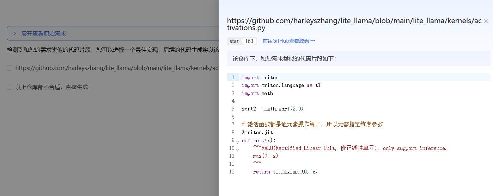
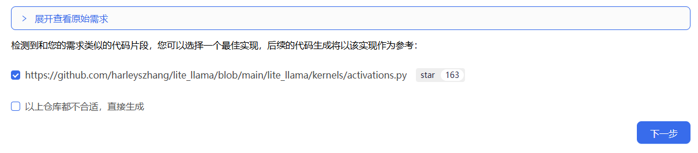

# 通过您的算子定义生成Kernel

登录 KernelGen 后，您将看到欢迎页面。

在欢迎页面上，执行以下步骤以生成Kernel：

1. 在文本框中，输入算子定义生成的提示词，然后点击 {w=20px}。

   算子定义生成的提示词必须包含以下信息：

   - 算子名称
   - 功能描述
   - 输入参数及其数据类型
   - 输出参数及其数据类型

   KernelGen 会搜索 GitHub 仓库列表，以查找与算子定义相似的代码片段。有关仓库列表的更多信息，请参阅 [仓库列表](../search-repo-list.md)。

2. 点击每个 URL，在右侧面板中查看相应的代码片段。

   您也可以查看代码片段的 GitHub 源代码或查看原始需求：
   - 要查看代码片段的源代码，请在此面板中点击 **前往GitHub查看源码**。
   - 要查看原始需求，请关闭此面板，然后点击顶部的 **展开查看原始需求**。
  

3. 选择一个或多个仓库 URL 以供参考，或选择直接生成复选框，然后点击 **下一步**。
   
4. 在确认对话框中，点击 **确认**。

5. 在算子定义和配置页面上，根据需要修改以下参数和配置，然后点击 **下一步**：
   - 在 **算子定义** 部分，修改以下参数：
     - **算子名称**：从您的算子定义中提取。
     - **评测设备**：算子评测设备。这与您在提示词中包含的算子生成设备不同。
     - **算子类型**：根据您的算子定义推断。
     - **功能描述**：从您的算子定义中提取。
     - **输入参数**：从您的算子定义中提取。
     - **输出参数**：从您的算子定义中提取。
   - 在 **KernelGen 配置** 部分，修改以下配置：
     - **自动优化最大迭代轮次**：KernelGen 尝试通过正确性测试的最大迭代次数。
   
6. 在确认对话框中，点击 **确认**。

   KernelGen 开始执行Kernel代码生成、CUDA 版基准实现、正确性测例和加速比测试。

7. 在右侧的 **KernelGen** 面板中，检查 **Kernel**、**CUDA版基准实现**、**正确性测例** 和 **加速比测例** 的状态。

   状态将变为 **生成中**。

   