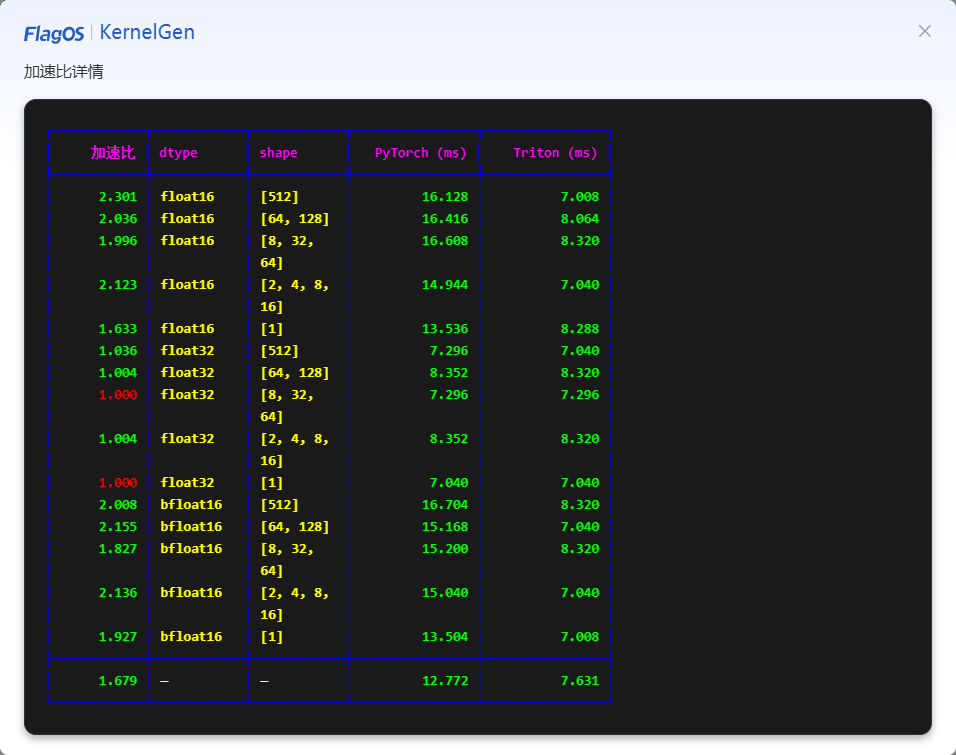

# 查看生成结果并选择最优 Kernel

当 **Kernel**、**CUDA版基准实现**、**正确性测例** 和 **加速比测例** 的状态变为 **已生成** 时，表示 Kernel 已成功生成。随后，您可以评估测试结果并选择一个最优 Kernel。

请按以下步骤查看测试结果并选择最优 Kernel：

- 如果 **正确性测例** 变为绿色，则表示正确性测例通过。接着，检查整体的 **加速比测例** 是否满足您的要求。

   

  - 如果整体的 **加速比测例** 满足您的要求，请执行以下步骤：
    1. 点击 **查看详情** 以查看每个场景的加速比。
    
    2. 如果每个场景的加速比也满足您的要求，请点击顶部的 **下载 Kernel** 以下载 Kernel 代码以供后续使用。如果您需要使用正确性测试和加速比测试的结果，请点击 **正确性测例** 和 **加速比测例** 部分，复制并粘贴相应的代码。
  
  - 如果整体的 **加速比测例** 不满足您的要求，您可以手动修改 **Kernel** 部分中的 Kernel 代码，然后点击 **加速比测例** 以开始新一轮迭代。
    - 如果存在多次迭代，您可以选择其中一次迭代，并点击该迭代上的 **使用该代码**。相应的 Kernel 代码将填充到 **Kernel** 部分后，点击顶部的 **下载Kernel** 即可下载 Kernel 代码以供后续使用。

- 如果 **正确性测例** 变为红色，您可以手动修改 **Kernel** 部分中的 Kernel 代码，然后点击 **正确性测例** 以开始新一轮迭代，直至正确性测试通过，然后下载 Kernel。

- 如果您想返回欢迎页面从头开始编写提示词，或者发生超时，您可以点击 **回到首页**，然后点击 **确认**。请注意，在此情况下您的数据将会丢失。
